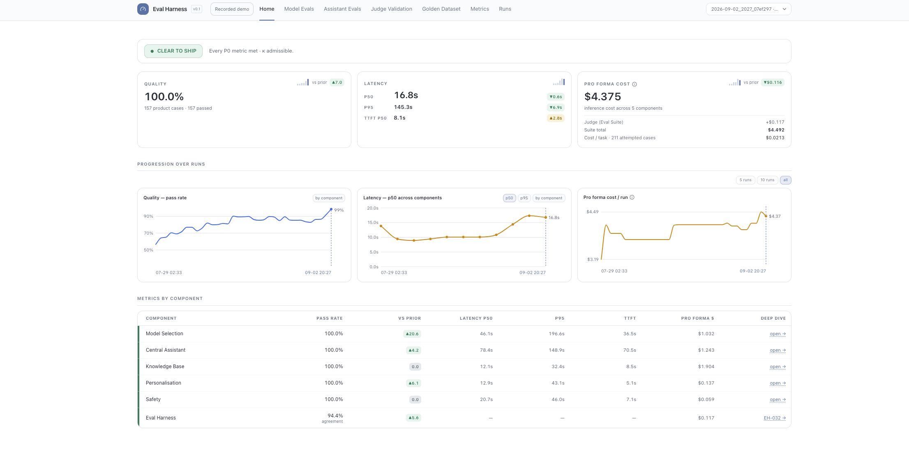

# Michael Ma

  

## About 
**I build agentic systems that carry out real work reliably, end to end, and the evals that decide when they are ready to ship:** 
- By day, I head GenAI and Merchant Fulfilment (MFN) product management at Amazon, with a record of 0-to-1 launches.
- By night, I build **Central**, an AI assistant harness that handles knowledge work in one calm interface at \$0 inference cost, with personalisation, safety guardrails and approval before it acts. Alongside it, the **Eval Harness** gates each release on 211 golden test cases, scored in code or by an LLM judge validated against human labels.
- I'm most excited about frontier AI products that change how people work, learn, create and connect.

## Projects:
<table width="100%">
  <tr>
    <td width="50%" valign="top">
        
      <b><a href="https://github.com/michaelma-ai/portfolio/blob/main/central/README.md">Central</a></b> 
      Agentic AI assistant for knowledge work at &#36;0 inference cost: research, email, calendar and documents in one calm interface, with personalisation, safety guardrails and approval before it acts.  
       
    </td>
    <td width="50%" valign="top">
        
      <b><a href="https://github.com/michaelma-ai/portfolio/blob/main/eval_harness/README.md">Eval Harness</a></b> 
      Offline evals and release gate for Central: 211 golden cases, scored in code or by an LLM judge validated against human labels, with one release verdict.  
       
    </td>
  </tr>
</table>

## Connect
  
